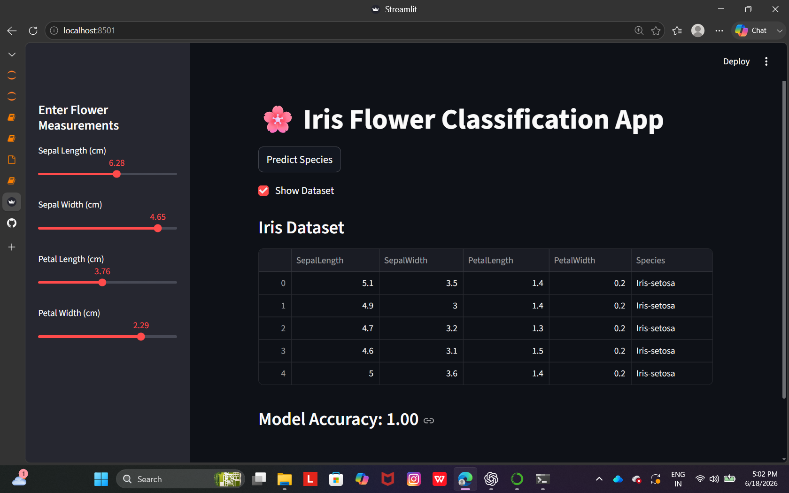
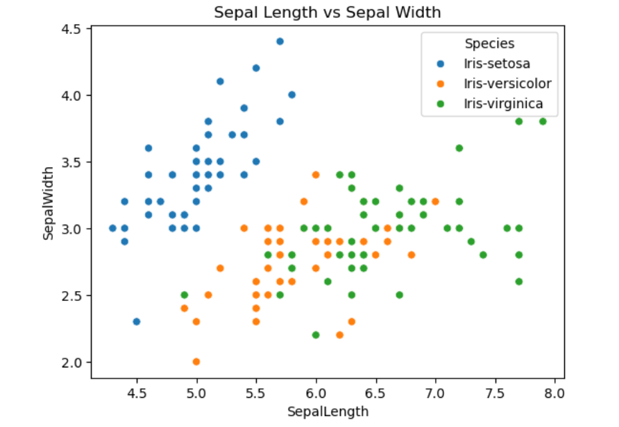

# 🌸 Iris Flower Classification using Machine Learning


## 🏢 Internship Project

This project was developed as part of the **QSkill Artificial Intelligence & Machine Learning Internship Program (June 2026)**.

### Internship Details

* Organization: QSkill
* Domain: Artificial Intelligence & Machine Learning
* Internship Duration: June 1, 2026 – July 1, 2026
* Project: Iris Flower Classification
* Objective: Classify Iris flowers into three species using Machine Learning techniques and evaluate model performance using standard classification metrics.

This project demonstrates practical experience in data preprocessing, exploratory data analysis, machine learning model development, model evaluation, and deployment using Streamlit.

## 📌 Project Overview

This project focuses on classifying Iris flowers into three species:

* Iris Setosa
* Iris Versicolor
* Iris Virginica

The classification is performed using Machine Learning techniques based on four flower measurements:

* Sepal Length
* Sepal Width
* Petal Length
* Petal Width

A Logistic Regression model is trained on the Iris dataset and deployed through a Streamlit web application for real-time predictions.

---

## 🎯 Objective

To build a machine learning model that accurately predicts the species of an Iris flower using its physical characteristics.

---

## 📂 Dataset

The project uses the famous Iris dataset containing:

* 150 samples
* 4 numerical features
* 3 flower species

Features:

| Feature      | Description          |
| ------------ | -------------------- |
| Sepal Length | Length of sepal (cm) |
| Sepal Width  | Width of sepal (cm)  |
| Petal Length | Length of petal (cm) |
| Petal Width  | Width of petal (cm)  |

---

## 🛠️ Technologies Used

* Python
* Pandas
* NumPy
* Matplotlib
* Seaborn
* Scikit-Learn
* Streamlit
* Jupyter Notebook

---

## 📊 Exploratory Data Analysis

The dataset was explored using:

* Scatter Plots
* Histograms
* Statistical Summary
* Class Distribution Analysis

---

## 🤖 Machine Learning Model

Algorithm Used:

* Logistic Regression

Steps Performed:

1. Data Loading
2. Data Exploration
3. Train-Test Split
4. Model Training
5. Prediction
6. Performance Evaluation

---

## 📈 Model Performance

Evaluation Metrics:

* Accuracy Score
* Precision
* Recall
* F1-Score
* Confusion Matrix

### Results

Accuracy Achieved: **100%**

Classification Report:

* Precision: 1.00
* Recall: 1.00
* F1-Score: 1.00

---

## 🌐 Streamlit Web Application

The project includes an interactive Streamlit application where users can:

* Enter flower measurements
* Predict Iris species instantly
* View model accuracy
* Explore the dataset

---

## 📁 Project Structure

```text
Iris-Flower-Classification/
│
├── iris.data
├── iris_classification.ipynb
├── app.py
```

---

## 🚀 How to Run

### Clone Repository

```bash
git clone https://github.com/bindu-ai-dev/Iris-Classification-Logistic-Regression.git
cd Iris-Classification-Logistic-Regression
```

### Install Dependencies

```bash
pip install -r requirements.txt
```

### Run Streamlit Application

```bash
streamlit run app.py
```

---

## Screenshots

### Dataset Preview


### Scatter Plot


### Histogram


### Confusion Matrix


### Streamlit Application


### Prediction Result







## 📸 Output

* Data Visualization using Scatter Plots and Histograms
* Confusion Matrix
* Classification Report
* Streamlit Prediction Interface

---

## 🎓 Skills Gained

* Data Analysis
* Data Visualization
* Classification Modeling
* Machine Learning
* Model Evaluation
* Streamlit Deployment
* GitHub Project Management

---

## 👩‍💻 Author

**Bindu**

Machine Learning Intern at QSkill

Passionate about Artificial Intelligence, Machine Learning, and Data Science.
